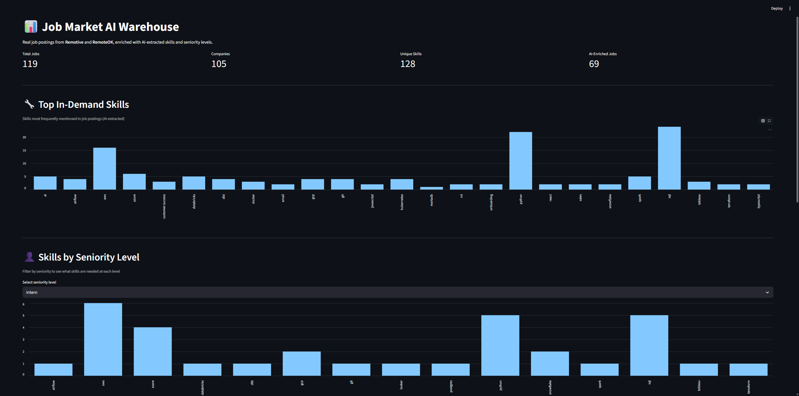
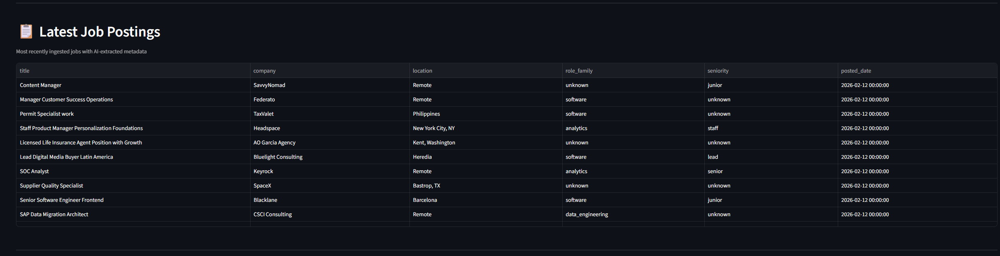

# 🚀 Job Market AI Warehouse

An end-to-end **data engineering pipeline** that ingests live job postings, enriches them with AI-extracted skills and seniority using a local LLM, and serves analytics through a Streamlit dashboard.

---

## 📸 Dashboard Preview

### Overview


### Job Listings


---

## 🏗 Architecture

```
[Remotive API]      [RemoteOK API]
        |                    |
        +---------+----------+
                  |
             [RAW Layer]
          raw_job_postings
                  |
             [SILVER Layer]
    dim_company, dim_location,
    dim_role, fact_job_posting,
    bridge_job_skill
                  |
           [AI Enrichment]
          Ollama (local LLM)
        Extract skills + level
                  |
             [GOLD Layer]
    mart_top_skills_daily
    mart_skill_by_seniority
    mart_top_companies
                  |
         [Streamlit Dashboard]
```

---

## 📊 Key Data Engineering Features

- Idempotent ingestion (safe re-runs, no duplicates)
- Raw → Silver → Gold warehouse layering
- Star schema design (fact + dimension tables)
- Many-to-many bridge table for job ↔ skills
- AI enrichment using local Ollama LLM
- Data quality validation checks
- Structured logging for pipeline observability

---

## 🧠 Tech Stack

- Python 3.11
- DuckDB (embedded analytics warehouse)
- Ollama (local LLM)
- Streamlit
- Pandas
- Pydantic
- Requests
- Pytest

---

## ⚙️ How To Run

Install dependencies:

```bash
pip install -r requirements.txt
```

(Optional) Pull AI model:

```bash
ollama pull llama3.1
```

Run pipeline:

```bash
python -m src.pipeline.run
```

Launch dashboard:

```bash
streamlit run dashboard/app.py
```

---

## 🧪 Testing

```bash
python -m pytest tests/ -v
```

---

## 👤 Author

Stefan Nguyen  
Aspiring Data Engineer  
